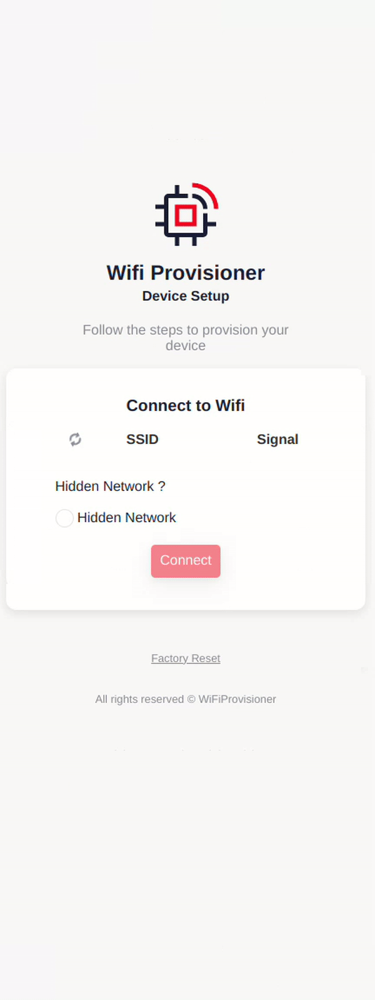
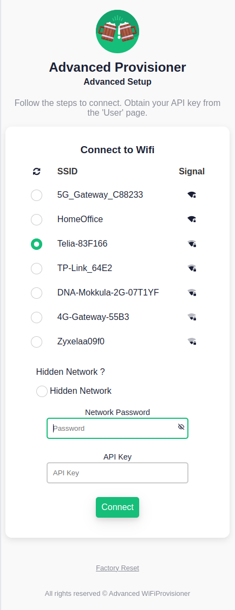
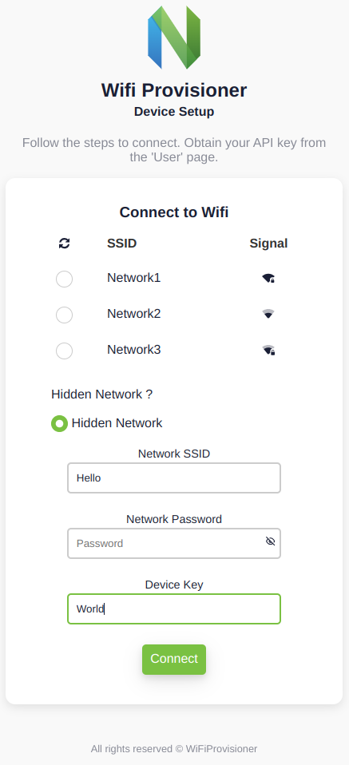
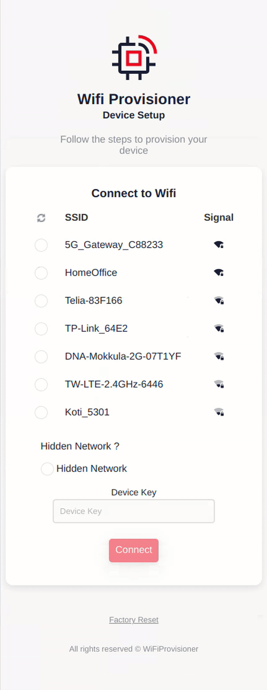

# WiFi Provisioning Library for ESP32

This library provides an easy-to-use, customizable solution for setting up a modern-looking WiFi provisioning captive portal on an ESP32 device. This allows you to effortlessly provision your ESP32 with WiFi credentials, collect custom input, or perform a factory reset—all through an intuitive and user-friendly interface.

> _**Note:** This library is designed for ESP32 devices and depends on the ESP32 core and its specific libraries (DNSServer, WebServer, and WiFi). Make sure you have the ESP32 core installed in your Arduino IDE before using this library._

## Features
- **Access Point Mode with Captive Portal**  
  Quickly set up WiFi provisioning with a captive portal, accessible easily from any device.
  
  
- **Lightweight and Modern Interface**  
  A sleek, responsive, and lightweight UI.
  

- **Simple Customization**  
  Easily adjust colors, logos, text, and themes to match your branding or project needs.
  

- **Optional Input Field**  
  Gather user-specific data (e.g., keys, codes) during the provisioning process.
  
  
- **Event Callbacks**  
  Hook into provisioning events like input validation, factory reset, and provisioning start.
  

## Installation
### Installation from ZIP file
1. Download the library as a ZIP file.
2. Open the Arduino IDE, go to **Sketch** > **Include Library** > **Add .ZIP Library**, and select the downloaded ZIP file.
3. The library will be installed and available in the **Examples** menu.

### Installation using Arduino Library Manager

1. Open the Arduino IDE, go to **Tools** > **Manage Libraries**.
2. In the Library Manager window, type `WiFiProvisioner` into the search bar.
3. Find the library in the search results, select the latest version, and click **Install**.

## Usage

1. Include the library in your Arduino sketch:

```cpp
#include <WiFiProvisioner.h>

void setup() {
  Serial.begin(9600);

  // Create the WiFiProvisioner instance
  WiFiProvisioner provisioner;

  // Configure to hide additional fields
  provisioner.getConfig().SHOW_INPUT_FIELD = false; // No additional input field
  provisioner.getConfig().SHOW_RESET_FIELD = false; // No reset field

  // Set the success callback
  provisioner.onSuccess(
      [](const char *ssid, const char *password, const char *input) {
        Serial.printf("Provisioning successful! Connected to SSID: %s\n", ssid);
        if (password) {
          Serial.printf("Password: %s\n", password);
        }
      });

  // Start provisioning
  provisioner.startProvisioning();
}

void loop() { delay(100); }
```
## Functions

### `WiFiProvisioner(const Config &config = Config())`

Constructs a new `WiFiProvisioner` instance with the specified configuration.

- Initializes the WiFiProvisioner with either the provided configuration or the default configuration.
- The configuration dictates the behavior and appearance of the WiFi provisioning process, including AP details, UI elements, and behavioral options.

#### Example Usage
```cpp
// Default configuration
WiFiProvisioner provisioner;

// Custom configuration
WiFiProvisioner::Config customConfig(
    "CustomAP", "Custom Title", "darkblue", "<custom_svg>",
    "Custom Project", "Custom Setup", "Custom Information",
    "Custom Footer", "Success Message", "Are you sure?",
    "Custom Key", 10, true, false);
WiFiProvisioner provisioner(customConfig);

// Custom configuration
WiFiProvisioner provisioner(
    {"CustomAP", "Custom Title", "darkblue", "<custom_svg>", "Custom Project",
      "Custom Setup", "Custom Information", "Custom Footer", "Success Message",
      "Are you sure?", "Custom Key", 10, true, false});
```

### `Config &getConfig()`

Provides access to the configuration structure.

- This method returns a reference to the Config structure, allowing controlled access to modify the configuration values after the instance has been created.
- Users should always use this method to modify the configuration, as the library operates on an internal copy of the configuration.

#### Example Usage
```cpp
WiFiProvisioner provisioner;
provisioner.getConfig().AP_NAME = "UpdatedAP";
provisioner.getConfig().SHOW_INPUT_FIELD = true;
```

#### `bool startProvisioning()`
Starts the provisioning process by setting up the device in Access Point (AP) mode with a captive portal for Wi-Fi configuration.

#### Access Instructions:
1. Open your device's Wi-Fi settings.
2. Connect to the Wi-Fi network specified by `AP_NAME` in the configuration:
   - **Default**: `"ESP32 Wi-Fi Provisioning"`.
3. Once connected, the provisioning page will open automatically. You can also access it manually by opening a web browser and navigating to `http://192.168.4.1/`.

#### Return Value:
- `true`: If the provisioning process is successful, meaning:
  - The device has successfully connected to the specified Wi-Fi network.
  - Input was valididated (if set).
  - The Wi-Fi mode is set to **station mode (STA)**
- `false`: If the provisioning process fails.

#### Example Usage
```cpp
WiFiProvisioner provisioner;
if (!provisioner.startProvisioning()) {
    Serial.println("Provisioning failed. Check logs for details.");
}
```

## Callback Types

#### `onProvision`
Defines actions to perform at the start of the provisioning process. 
- Use this callback to conditionally show or hide input fields, update interface text etc..
- The callback is invoked everytime before the provisioning portal is served.
- This callback is also triggered **after a factory reset**, ensuring the provisioning page reflects the latest configuration when it is served again.

Example:
```cpp
provisioner.onProvision([]() {
  if (hasApiKey()) {
    provisioner.getConfig().SHOW_INPUT_FIELD = false;
    Serial.println("API key exists. Input field hidden.");
  } else {
    provisioner.getConfig().SHOW_INPUT_FIELD = true;
    Serial.println("No API key found. Input field shown.");
  }
});
```
#### `onInputCheck`
Validates user input during the provisioning process. The callback function takes a single parameter of type `const char*` and returns a `bool` to indicate whether the input is valid.

- This callback acts as a **gatekeeper** to ensure the input meets specific criteria before completing the provisioning process and calling the `onSuccess` callback.
- If the input validation fails (i.e., the callback returns `false`), an error message will be displayed to the user indicating the input is invalid.
- **WiFi is already connected successfully** to reach this callback, allowing you to perform checks that require an active network connection (e.g., API calls or HTTP requests).
  
**Parameters**:
- `const char* input`: The user-provided input to validate.

Example:
```cpp
provisioner.onInputCheck([](const char *input) -> bool {
  Serial.printf("Checking if input code equals to 1234: %s\n", input);
  return strcmp(input, "1234") == 0; // Validate input
})
```
#### `onFactoryReset`
Allows you to define custom actions to execute when a factory reset is triggered. This is the ideal place to clear saved data, such as API keys, WiFi credentials, or any other stored inputs.

- Use this callback to perform cleanup tasks.
- The callback is invoked whenever a factory reset is initiated through the provisioning portal.

Example:
```cpp
provisioner.onFactoryReset([]() { 
  Serial.println("Factory reset triggered!"); 
});
```
#### `onSuccess`
Invoked after the device has been successfully connected to the Wi-Fi network and user input has been validated (if enabled). This is the final step in the provisioning process, making it an ideal place to handle post-provisioning logic, such as saving configuration.

- Use this callback to store Wi-Fi credentials and input details.

**Parameters**:
- `const char* ssid`: The SSID of the connected Wi-Fi network.
- `const char* password`: The password for the Wi-Fi network (or `nullptr` for open networks).
- `const char* input`: The user-provided input (or `nullptr` if the input field is disabled).

Example:
```cpp
provisioner.onSuccess([](const char *ssid, const char *password, const char *input) {
  Serial.printf("Provisioning successful! SSID: %s\n", ssid);
  preferences.begin("wifi-provision", false);
  // Store the credentials and API key in preferences
  preferences.putString("ssid", String(ssid));
  if (password) {
    preferences.putString("password", String(password));
  }
  if (input) {
    preferences.putString("apikey", String(input));
  }
  preferences.end();
  Serial.println("Credentials and API key saved.");
});
```

## Customization

You can customize various aspects of the library, such as the HTML content, input validation, and behavior after a successful connection. The following configuration options are available in the `WiFiProvisioner::Config` struct:

### Configuration Options

| Option                    | Description                                      |
|---------------------------|--------------------------------------------------|
| `AP_NAME`                 | Name of the Wi-Fi Access Point                  |
| `HTML_TITLE`              | Title of the provisioning web page              |
| `THEME_COLOR`             | Theme color for the provisioning UI             |
| `SVG_LOGO`                | Custom SVG logo to display on the web page      |
| `PROJECT_TITLE`           | Title displayed on the provisioning page        |
| `PROJECT_SUB_TITLE`       | Subtitle displayed below the project title      |
| `PROJECT_INFO`            | Instructions or description for the user        |
| `FOOTER_TEXT`             | Footer text displayed at the bottom of the page |
| `CONNECTION_SUCCESSFUL`   | Success message shown after successful connection |
| `RESET_CONFIRMATION_TEXT` | Confirmation text for resetting the device      |
| `INPUT_TEXT`              | Label text for the additional input field       |
| `INPUT_LENGTH`            | Maximum length for the additional input field   |
| `SHOW_INPUT_FIELD`        | Whether to display the additional input field   |
| `SHOW_RESET_FIELD`        | Whether to display the factory reset option     |

### Default Values

- **`AP_NAME`**: `"ESP32 Wi-Fi Provisioning"`  
- **`HTML_TITLE`**: `"Welcome to Wi-Fi Provision"`  
- **`THEME_COLOR`**: `"dodgerblue"`  
- **`SVG_LOGO`**: A default SVG logo  
- **`PROJECT_TITLE`**: `"WiFi Provisioner"`  
- **`PROJECT_SUB_TITLE`**: `"Device Setup"`  
- **`PROJECT_INFO`**: `"Follow the steps to provision your device"`  
- **`FOOTER_TEXT`**: `"All rights reserved © WiFiProvisioner"`  
- **`CONNECTION_SUCCESSFUL`**: `"Your device is now provisioned and ready to use."`  
- **`RESET_CONFIRMATION_TEXT`**: `"This process cannot be undone."`  
- **`INPUT_TEXT`**: `"Device Key"`  
- **`INPUT_LENGTH`**: `4`  
- **`SHOW_INPUT_FIELD`**: `false`  
- **`SHOW_RESET_FIELD`**: `true`  
  
### Customization Examples

To customize the provisioning portal, you can modify the `WiFiProvisioner::Config` struct before starting the provisioning process.

#### Example: Initial Customization

```cpp
WiFiProvisioner::Config customConfig(
    "MyCustomAP",                    // Access Point Name
    "Welcome!",                      // HTML Page Title
    "#007BFF",                       // Theme Color
    "<svg>...</svg>",                // SVG Logo
    "Custom Project",                // Project Title
    "Setup Your Device",             // Project Sub-title
    "Follow these steps:",           // Project Info
    "All rights reserved © MyProject", // Footer Text
    "Connected!",                    // Success Message
    "Reset all?",                    // Reset Confirmation Text
    "Enter Key:",                    // Input Field Label
    6,                               // Input Field Length
    true,                            // Show Input Field
    true                             // Show Reset Field
);
WiFiProvisioner provisioner(customConfig);

// Or directly 
WiFiProvisioner provisioner(
    {"CustomAP", "Custom Title", "darkblue", "<custom_svg>", "Custom Project",
      "Custom Setup", "Custom Information", "Custom Footer", "Success Message",
      "Are you sure?", "Custom Key", 10, true, false});
```


#### Example: Modifying Config After Construction

After constructing a WiFiProvisioner instance, always use the `getConfig()` method to access and modify the configuration. Avoid editing the original Config object used during construction, as the library operates on an internal copy of the configuration.

```cpp
// Access the configuration for modifications
WiFiProvisioner::Config &config = provisioner.getConfig();

// Update fields dynamically
config.PROJECT_TITLE = "Updated Project Title";
config.SVG_LOGO = R"rawliteral(<svg xmlns="http://www.w3.org/2000/svg" width="50" height="50" viewBox="0 0 50 50"><rect width="50" height="50" rx="10" ry="10" fill="#f00"/></svg>)rawliteral";
config.THEME_COLOR = "#FF5733"; // Set a new theme color
config.SHOW_INPUT_FIELD = false; // Hide the input field
```

##  Examples
The library includes examples that demonstrate different customization options. To access the examples, go to File > Examples > WiFiProvisioner in the Arduino IDE.

### Example: Simple Provisioning

```cpp
#include <WiFiProvisioner.h>

void setup() {
  Serial.begin(9600);

  // Create the WiFiProvisioner instance
  WiFiProvisioner provisioner;

  // Configure to hide additional fields
  provisioner.getConfig().SHOW_INPUT_FIELD = false; // No additional input field
  provisioner.getConfig().SHOW_RESET_FIELD = false; // No reset field

  // Set the success callback
  provisioner.onSuccess(
      [](const char *ssid, const char *password, const char *input) {
        Serial.printf("Provisioning successful! Connected to SSID: %s\n", ssid);
        if (password) {
          Serial.printf("Password: %s\n", password);
        }
      });

  // Start provisioning
  provisioner.startProvisioning();
}

void loop() { delay(100); }
```

### Example: Custom Configuration
```cpp
#include <WiFiProvisioner.h>

void setup() {
  Serial.begin(9600);

  // Define a custom configuration
  WiFiProvisioner::Config customCfg(
      "Advanced Wi-Fi Provisioning",   // Access Point Name
      "Welcome to Advanced Provision", // HTML Page Title
      "#15be79",                       // Theme Color
      R"rawliteral(<svg id="Icons" xmlns="http://www.w3.org/2000/svg" width="5rem" height="5rem" viewBox="0 0 512 512"><defs><style>.cls-3{fill:#7a2b13}.cls-4{fill:#8c4735}.cls-5{fill:#a05740}.cls-6{fill:#b76049}.cls-7{fill:#c2aacf}.cls-8{fill:#decee5}.cls-9{fill:#f4e6f4}.cls-10{fill:#fff}.cls-11{fill:#33db92}</style></defs><circle cx="256" cy="256" r="255.98" style="fill:#15be79"/><path d="M508.81 296.61c-14.63 12.52-29.54 23.9-48.29 25.6-22 2-42.82-10.62-58.66-26s-28.54-33.88-45.22-48.36a129.2 129.2 0 0 0-181 11.46c-16.27 18.23-30.47 43-54.75 45.88-33 3.93-58.78-36.33-91.88-33.27-9.67.91-18.52 5.49-27.79 8.38C-12.24 139.7 90.78 14.78 231.4 1.2s265.81 89.48 279.4 230.2a256.53 256.53 0 0 1-1.99 65.21z" style="fill:#14a36d"/><path class="cls-3" d="m466.6 201.25 17.24 64.35a13 13 0 0 1-9.19 15.93l-39.28 10.53-4.45-16.62 29.84-8a5.55 5.55 0 0 0 3.94-6.82l-12.19-45.49a5.57 5.57 0 0 0-6.82-3.94l-29.85 8-4.45-16.62 39.28-10.52a13 13 0 0 1 15.93 9.2z"/><path class="cls-4" d="m466.6 201.25 15.4 57.4a13 13 0 0 1-9.19 15.93l-24.41 6.54a3.93 3.93 0 0 1-4.81-2.77l-.56-2.09a3.92 3.92 0 0 1 2.78-4.8L466.3 266a5.57 5.57 0 0 0 3.94-6.82l-14.05-52.45a5.58 5.58 0 0 0-6.82-3.94l-20.52 5.5a3.93 3.93 0 0 1-4.81-2.78l-.55-2.07a3.92 3.92 0 0 1 2.77-4.81l24.41-6.54a13 13 0 0 1 15.93 9.16z"/><ellipse class="cls-5" cx="464.97" cy="214.19" rx="4.92" ry="10.84" transform="rotate(-15 464.966 214.178)"/><ellipse class="cls-5" cx="470.59" cy="235.15" rx="3.41" ry="7.52" transform="rotate(-15 470.587 235.164)"/><rect class="cls-3" x="289.73" y="174.18" width="136.84" height="188.06" rx="10.87" transform="rotate(-15 358.133 268.192)"/><path class="cls-4" d="m402.71 170.18 41.86 156.21-106.27 28.47-44.67-166.71 95.76-25.66a10.87 10.87 0 0 1 13.32 7.69zM293.63 188.15 342.3 369.8l-15.4 4.13a10.88 10.88 0 0 1-13.32-7.69l-43-160.65a10.88 10.88 0 0 1 7.69-13.32z"/><path class="cls-4" d="m402.71 170.18 43.05 160.64a10.88 10.88 0 0 1-7.69 13.32l-15.4 4.13L374 166.61l15.4-4.12a10.87 10.87 0 0 1 13.31 7.69z"/><path class="cls-4" transform="rotate(-15 340.426 272.97)" d="M327.02 178.92h26.82v188.06h-26.82z"/><path class="cls-4" transform="rotate(-15 375.872 263.456)" d="M362.45 169.43h26.82v188.06h-26.82z"/><path class="cls-5" d="m282.66 191.09 11-2.94 44.64 166.71-.47.13a10.87 10.87 0 0 1-13.31-7.69z"/><path class="cls-5" transform="rotate(-15 338.437 265.483)" d="M325.02 179.19h26.82v172.6h-26.82z"/><path class="cls-5" transform="rotate(-15 373.84 256.002)" d="M360.45 169.69h26.82v172.6h-26.82z"/><path class="cls-5" d="m402.71 170.18 41.86 156.21-25.91 6.94L374 166.61l15.4-4.12a10.87 10.87 0 0 1 13.31 7.69z"/><ellipse class="cls-6" cx="402.02" cy="213.92" rx="8.72" ry="20.76" transform="rotate(-15 402.02 213.928)"/><ellipse class="cls-6" cx="412.36" cy="252.5" rx="5.54" ry="12.59" transform="rotate(-15 412.36 252.496)"/><ellipse class="cls-6" cx="369.98" cy="236.15" rx="8.72" ry="20.76" transform="rotate(-15 370.003 236.14)"/><ellipse class="cls-6" cx="380.32" cy="274.73" rx="5.54" ry="12.59" transform="rotate(-15 380.336 274.747)"/><ellipse class="cls-6" cx="337.97" cy="258.38" rx="8.72" ry="20.76" transform="rotate(-15 337.98 258.39)"/><ellipse class="cls-6" cx="348.3" cy="296.96" rx="5.54" ry="12.59" transform="rotate(-15 348.318 296.959)"/><rect class="cls-7" x="270.99" y="202.54" width="143.97" height="18.05" rx="3.04" transform="rotate(-15 342.985 211.565)"/><path class="cls-8" d="m411 187.16 2.59 9.64-127.87 34.25a3 3 0 0 1-3.72-2.15l-2.59-9.65L407.22 185a3 3 0 0 1 3.78 2.16z"/><ellipse class="cls-9" cx="367.49" cy="201.73" rx="12.14" ry="4.46" transform="rotate(-15 367.5 201.733)"/><ellipse class="cls-9" cx="390.05" cy="195.68" rx="7.36" ry="2.83" transform="rotate(-15 390.048 195.699)"/><rect class="cls-7" x="299.63" y="309.46" width="143.97" height="18.05" rx="3.04" transform="rotate(-15 371.602 318.493)"/><path class="cls-8" d="m439.6 294.08 2.59 9.64L314.37 338a3 3 0 0 1-3.73-2.15l-2.59-9.65 127.82-34.25a3 3 0 0 1 3.73 2.13z"/><ellipse class="cls-9" cx="396.14" cy="308.65" rx="12.14" ry="4.46" transform="rotate(-15 396.117 308.661)"/><ellipse class="cls-9" cx="418.7" cy="302.6" rx="7.36" ry="2.83" transform="rotate(-15 418.707 302.594)"/><path class="cls-10" d="m278 192.32 111.6-29.92a15.8 15.8 0 0 0-24.48-8.85 15.89 15.89 0 0 0-30.66 7.87 24.64 24.64 0 0 0-27.1 5.37 12.3 12.3 0 0 0-23.36 7.48 12.09 12.09 0 0 0 1.48 3.4 12.3 12.3 0 0 0-7.48 14.65z"/><path class="cls-10" d="M274.66 294.93a14.25 14.25 0 0 0 14.25-14.25l-7.17-86.1a7.08 7.08 0 0 0-7.08-6.78 7.08 7.08 0 0 0-7.07 6.78l-7.18 86.1a14.25 14.25 0 0 0 14.25 14.25z"/><rect class="cls-10" x="259.3" y="306.15" width="30.73" height="36.43" rx="15.36" transform="rotate(180 274.665 324.365)"/><path class="cls-3" d="M45.4 201.25 28.16 265.6a13 13 0 0 0 9.19 15.93l39.28 10.53 4.45-16.62-29.84-8a5.55 5.55 0 0 1-3.94-6.82l12.19-45.49a5.57 5.57 0 0 1 6.82-3.94l29.85 8 4.45-16.62-39.28-10.52a13 13 0 0 0-15.93 9.2z"/><path class="cls-4" d="M45.4 201.25 30 258.65a13 13 0 0 0 9.19 15.93l24.41 6.54a3.93 3.93 0 0 0 4.81-2.77l.56-2.09a3.92 3.92 0 0 0-2.78-4.8L45.7 266a5.57 5.57 0 0 1-3.94-6.82l14.05-52.45a5.58 5.58 0 0 1 6.82-3.94l20.52 5.5a3.93 3.93 0 0 0 4.85-2.82l.55-2.07a3.92 3.92 0 0 0-2.77-4.81l-24.41-6.54a13 13 0 0 0-15.97 9.2z"/><ellipse class="cls-5" cx="47.03" cy="214.19" rx="10.84" ry="4.92" transform="rotate(-75 47.026 214.193)"/><ellipse class="cls-5" cx="41.41" cy="235.15" rx="7.52" ry="3.41" transform="rotate(-75 41.414 235.148)"/><rect class="cls-3" x="59.82" y="199.79" width="188.06" height="136.84" rx="10.87" transform="rotate(-75 153.85 268.21)"/><path class="cls-4" d="M109.29 170.18 67.43 326.39l106.27 28.47 44.67-166.71-95.76-25.66a10.87 10.87 0 0 0-13.32 7.69zM218.37 188.15 169.7 369.8l15.4 4.13a10.88 10.88 0 0 0 13.32-7.69l43-160.65a10.88 10.88 0 0 0-7.69-13.32z"/><path class="cls-4" d="M109.29 170.18 66.24 330.82a10.88 10.88 0 0 0 7.69 13.32l15.4 4.13L138 166.61l-15.4-4.12a10.87 10.87 0 0 0-13.31 7.69z"/><path class="cls-4" transform="rotate(-75 171.568 272.954)" d="M77.54 259.54H265.6v26.82H77.54z"/><path class="cls-4" transform="rotate(-75 136.137 263.46)" d="M42.11 250.05h188.06v26.82H42.11z"/><path class="cls-5" d="m229.34 191.09-11-2.94-44.64 166.71.47.13a10.87 10.87 0 0 0 13.31-7.69z"/><path class="cls-5" transform="rotate(-75 173.572 265.485)" d="M87.27 252.08h172.6v26.82H87.27z"/><path class="cls-5" transform="rotate(-75 138.142 255.99)" d="M51.84 242.58h172.6v26.82H51.84z"/><path class="cls-5" d="M109.29 170.18 67.43 326.39l25.91 6.94L138 166.61l-15.4-4.12a10.87 10.87 0 0 0-13.31 7.69z"/><ellipse class="cls-6" cx="109.98" cy="213.92" rx="20.76" ry="8.72" transform="rotate(-75 109.974 213.92)"/><ellipse class="cls-6" cx="99.64" cy="252.5" rx="12.59" ry="5.54" transform="rotate(-75 99.636 252.502)"/><ellipse class="cls-6" cx="142.02" cy="236.15" rx="20.76" ry="8.72" transform="rotate(-75 142.015 236.156)"/><ellipse class="cls-6" cx="131.68" cy="274.73" rx="12.59" ry="5.54" transform="rotate(-75 131.682 274.731)"/><ellipse class="cls-6" cx="174.03" cy="258.38" rx="20.76" ry="8.72" transform="rotate(-75 174.031 258.383)"/><ellipse class="cls-6" cx="163.7" cy="296.96" rx="12.59" ry="5.54" transform="rotate(-75 163.698 296.958)"/><rect class="cls-7" x="160" y="139.58" width="18.05" height="143.97" rx="3.04" transform="rotate(-75 169.033 211.563)"/><path class="cls-8" d="m101.05 187.16-2.59 9.64 127.82 34.25a3 3 0 0 0 3.72-2.15l2.59-9.65L104.78 185a3 3 0 0 0-3.73 2.16z"/><ellipse class="cls-9" cx="144.51" cy="201.73" rx="4.46" ry="12.14" transform="rotate(-75 144.513 201.734)"/><ellipse class="cls-9" cx="121.95" cy="195.68" rx="2.83" ry="7.36" transform="rotate(-75 121.948 195.684)"/><rect class="cls-7" x="131.36" y="246.5" width="18.05" height="143.97" rx="3.04" transform="rotate(-75 140.382 318.48)"/><path class="cls-8" d="m72.4 294.08-2.59 9.64L197.63 338a3 3 0 0 0 3.73-2.15l2.59-9.65-127.82-34.28a3 3 0 0 0-3.73 2.16z"/><ellipse class="cls-9" cx="115.86" cy="308.65" rx="4.46" ry="12.14" transform="rotate(-75 115.861 308.651)"/><ellipse class="cls-9" cx="93.3" cy="302.6" rx="2.83" ry="7.36" transform="rotate(-75 93.304 302.606)"/><path class="cls-10" d="M234 192.32 122.4 162.4a15.8 15.8 0 0 1 24.48-8.85 15.89 15.89 0 0 1 30.66 7.87 24.64 24.64 0 0 1 27.1 5.37 12.3 12.3 0 0 1 23.36 7.48 12.09 12.09 0 0 1-1.48 3.4 12.3 12.3 0 0 1 7.48 14.65z"/><rect class="cls-11" x="251.74" y="66.35" width="8.51" height="54.43" rx="4.26"/><rect class="cls-11" x="224.98" y="79.06" width="8.51" height="44.01" rx="4.26" transform="matrix(.97 -.26 .26 .97 -18.35 62.77)"/><rect class="cls-11" x="200.93" y="98.29" width="8.51" height="32.56" rx="4.26" transform="rotate(-30 205.179 114.578)"/><rect class="cls-11" x="278.51" y="79.06" width="8.51" height="44.01" rx="4.26" transform="rotate(-165 282.766 101.064)"/><rect class="cls-11" x="302.55" y="98.29" width="8.51" height="32.56" rx="4.26" transform="rotate(-150 306.81 114.572)"/></svg>)rawliteral", // SVG Logo
      "Advanced Provisioner", // Project Title
      "Advanced Setup",       // Project Sub-title
      "Follow the steps to connect. Obtain your API key from "
      "the 'User' page.",                               // Project Information
      "All rights reserved © Advanced WiFiProvisioner", // Footer
                                                        // Text
      "The status LED will turn green, indicating a successful "
      "connection.", // Success Message
      "This action will erase all stored settings, including "
      "API key.", // Reset Confirmation Text
      "API Key",  // Input Field Text
      8,          // Input Field Length
      true,      // Show Input Field
      true        // Show Reset Field
  );

  // Create the WiFiProvisioner instance with the custom configuration
  WiFiProvisioner provisioner(customCfg);

  // Set up callbacks
  provisioner.onProvision([]() { Serial.println("Provisioning started."); })
      .onInputCheck([](const char *input) -> bool {
        Serial.printf("Checking if input code equals to 1234: %s\n", input);
        return strcmp(input, "1234") == 0; // Validate input
      })
      .onSuccess([](const char *ssid, const char *password, const char *input) {
        Serial.printf("Connected to SSID: %s\n", ssid);
        if (password) {
          Serial.printf("Password: %s\n", password);
        }
        if (input) {
          Serial.printf("Input: %s\n", input);
        }
        Serial.println("Provisioning completed successfully!");
      })
      .onFactoryReset([]() { Serial.println("Factory reset triggered!"); });

  // Start provisioning
  provisioner.startProvisioning();
}

void loop() { delay(100); }

```

### Example: Advanced Features with Button Trigger
```cpp
#include <Preferences.h>
#include <WiFi.h>
#include <WiFiProvisioner.h>

const int buttonPin = 9; // GPIO pin number for the built-in BOOT button

WiFiProvisioner provisioner(
    {"Advanced Wi-Fi Provisioning", "Welcome to Advanced Provision", "#15be79",
     R"rawliteral(<svg id="Icons" xmlns="http://www.w3.org/2000/svg" width="5rem" height="5rem" viewBox="0 0 512 512"><defs><style>.cls-3{fill:#7a2b13}.cls-4{fill:#8c4735}.cls-5{fill:#a05740}.cls-6{fill:#b76049}.cls-7{fill:#c2aacf}.cls-8{fill:#decee5}.cls-9{fill:#f4e6f4}.cls-10{fill:#fff}.cls-11{fill:#33db92}</style></defs><circle cx="256" cy="256" r="255.98" style="fill:#15be79"/><path d="M508.81 296.61c-14.63 12.52-29.54 23.9-48.29 25.6-22 2-42.82-10.62-58.66-26s-28.54-33.88-45.22-48.36a129.2 129.2 0 0 0-181 11.46c-16.27 18.23-30.47 43-54.75 45.88-33 3.93-58.78-36.33-91.88-33.27-9.67.91-18.52 5.49-27.79 8.38C-12.24 139.7 90.78 14.78 231.4 1.2s265.81 89.48 279.4 230.2a256.53 256.53 0 0 1-1.99 65.21z" style="fill:#14a36d"/><path class="cls-3" d="m466.6 201.25 17.24 64.35a13 13 0 0 1-9.19 15.93l-39.28 10.53-4.45-16.62 29.84-8a5.55 5.55 0 0 0 3.94-6.82l-12.19-45.49a5.57 5.57 0 0 0-6.82-3.94l-29.85 8-4.45-16.62 39.28-10.52a13 13 0 0 1 15.93 9.2z"/><path class="cls-4" d="m466.6 201.25 15.4 57.4a13 13 0 0 1-9.19 15.93l-24.41 6.54a3.93 3.93 0 0 1-4.81-2.77l-.56-2.09a3.92 3.92 0 0 1 2.78-4.8L466.3 266a5.57 5.57 0 0 0 3.94-6.82l-14.05-52.45a5.58 5.58 0 0 0-6.82-3.94l-20.52 5.5a3.93 3.93 0 0 1-4.81-2.78l-.55-2.07a3.92 3.92 0 0 1 2.77-4.81l24.41-6.54a13 13 0 0 1 15.93 9.16z"/><ellipse class="cls-5" cx="464.97" cy="214.19" rx="4.92" ry="10.84" transform="rotate(-15 464.966 214.178)"/><ellipse class="cls-5" cx="470.59" cy="235.15" rx="3.41" ry="7.52" transform="rotate(-15 470.587 235.164)"/><rect class="cls-3" x="289.73" y="174.18" width="136.84" height="188.06" rx="10.87" transform="rotate(-15 358.133 268.192)"/><path class="cls-4" d="m402.71 170.18 41.86 156.21-106.27 28.47-44.67-166.71 95.76-25.66a10.87 10.87 0 0 1 13.32 7.69zM293.63 188.15 342.3 369.8l-15.4 4.13a10.88 10.88 0 0 1-13.32-7.69l-43-160.65a10.88 10.88 0 0 1 7.69-13.32z"/><path class="cls-4" d="m402.71 170.18 43.05 160.64a10.88 10.88 0 0 1-7.69 13.32l-15.4 4.13L374 166.61l15.4-4.12a10.87 10.87 0 0 1 13.31 7.69z"/><path class="cls-4" transform="rotate(-15 340.426 272.97)" d="M327.02 178.92h26.82v188.06h-26.82z"/><path class="cls-4" transform="rotate(-15 375.872 263.456)" d="M362.45 169.43h26.82v188.06h-26.82z"/><path class="cls-5" d="m282.66 191.09 11-2.94 44.64 166.71-.47.13a10.87 10.87 0 0 1-13.31-7.69z"/><path class="cls-5" transform="rotate(-15 338.437 265.483)" d="M325.02 179.19h26.82v172.6h-26.82z"/><path class="cls-5" transform="rotate(-15 373.84 256.002)" d="M360.45 169.69h26.82v172.6h-26.82z"/><path class="cls-5" d="m402.71 170.18 41.86 156.21-25.91 6.94L374 166.61l15.4-4.12a10.87 10.87 0 0 1 13.31 7.69z"/><ellipse class="cls-6" cx="402.02" cy="213.92" rx="8.72" ry="20.76" transform="rotate(-15 402.02 213.928)"/><ellipse class="cls-6" cx="412.36" cy="252.5" rx="5.54" ry="12.59" transform="rotate(-15 412.36 252.496)"/><ellipse class="cls-6" cx="369.98" cy="236.15" rx="8.72" ry="20.76" transform="rotate(-15 370.003 236.14)"/><ellipse class="cls-6" cx="380.32" cy="274.73" rx="5.54" ry="12.59" transform="rotate(-15 380.336 274.747)"/><ellipse class="cls-6" cx="337.97" cy="258.38" rx="8.72" ry="20.76" transform="rotate(-15 337.98 258.39)"/><ellipse class="cls-6" cx="348.3" cy="296.96" rx="5.54" ry="12.59" transform="rotate(-15 348.318 296.959)"/><rect class="cls-7" x="270.99" y="202.54" width="143.97" height="18.05" rx="3.04" transform="rotate(-15 342.985 211.565)"/><path class="cls-8" d="m411 187.16 2.59 9.64-127.87 34.25a3 3 0 0 1-3.72-2.15l-2.59-9.65L407.22 185a3 3 0 0 1 3.78 2.16z"/><ellipse class="cls-9" cx="367.49" cy="201.73" rx="12.14" ry="4.46" transform="rotate(-15 367.5 201.733)"/><ellipse class="cls-9" cx="390.05" cy="195.68" rx="7.36" ry="2.83" transform="rotate(-15 390.048 195.699)"/><rect class="cls-7" x="299.63" y="309.46" width="143.97" height="18.05" rx="3.04" transform="rotate(-15 371.602 318.493)"/><path class="cls-8" d="m439.6 294.08 2.59 9.64L314.37 338a3 3 0 0 1-3.73-2.15l-2.59-9.65 127.82-34.25a3 3 0 0 1 3.73 2.13z"/><ellipse class="cls-9" cx="396.14" cy="308.65" rx="12.14" ry="4.46" transform="rotate(-15 396.117 308.661)"/><ellipse class="cls-9" cx="418.7" cy="302.6" rx="7.36" ry="2.83" transform="rotate(-15 418.707 302.594)"/><path class="cls-10" d="m278 192.32 111.6-29.92a15.8 15.8 0 0 0-24.48-8.85 15.89 15.89 0 0 0-30.66 7.87 24.64 24.64 0 0 0-27.1 5.37 12.3 12.3 0 0 0-23.36 7.48 12.09 12.09 0 0 0 1.48 3.4 12.3 12.3 0 0 0-7.48 14.65z"/><path class="cls-10" d="M274.66 294.93a14.25 14.25 0 0 0 14.25-14.25l-7.17-86.1a7.08 7.08 0 0 0-7.08-6.78 7.08 7.08 0 0 0-7.07 6.78l-7.18 86.1a14.25 14.25 0 0 0 14.25 14.25z"/><rect class="cls-10" x="259.3" y="306.15" width="30.73" height="36.43" rx="15.36" transform="rotate(180 274.665 324.365)"/><path class="cls-3" d="M45.4 201.25 28.16 265.6a13 13 0 0 0 9.19 15.93l39.28 10.53 4.45-16.62-29.84-8a5.55 5.55 0 0 1-3.94-6.82l12.19-45.49a5.57 5.57 0 0 1 6.82-3.94l29.85 8 4.45-16.62-39.28-10.52a13 13 0 0 0-15.93 9.2z"/><path class="cls-4" d="M45.4 201.25 30 258.65a13 13 0 0 0 9.19 15.93l24.41 6.54a3.93 3.93 0 0 0 4.81-2.77l.56-2.09a3.92 3.92 0 0 0-2.78-4.8L45.7 266a5.57 5.57 0 0 1-3.94-6.82l14.05-52.45a5.58 5.58 0 0 1 6.82-3.94l20.52 5.5a3.93 3.93 0 0 0 4.85-2.82l.55-2.07a3.92 3.92 0 0 0-2.77-4.81l-24.41-6.54a13 13 0 0 0-15.97 9.2z"/><ellipse class="cls-5" cx="47.03" cy="214.19" rx="10.84" ry="4.92" transform="rotate(-75 47.026 214.193)"/><ellipse class="cls-5" cx="41.41" cy="235.15" rx="7.52" ry="3.41" transform="rotate(-75 41.414 235.148)"/><rect class="cls-3" x="59.82" y="199.79" width="188.06" height="136.84" rx="10.87" transform="rotate(-75 153.85 268.21)"/><path class="cls-4" d="M109.29 170.18 67.43 326.39l106.27 28.47 44.67-166.71-95.76-25.66a10.87 10.87 0 0 0-13.32 7.69zM218.37 188.15 169.7 369.8l15.4 4.13a10.88 10.88 0 0 0 13.32-7.69l43-160.65a10.88 10.88 0 0 0-7.69-13.32z"/><path class="cls-4" d="M109.29 170.18 66.24 330.82a10.88 10.88 0 0 0 7.69 13.32l15.4 4.13L138 166.61l-15.4-4.12a10.87 10.87 0 0 0-13.31 7.69z"/><path class="cls-4" transform="rotate(-75 171.568 272.954)" d="M77.54 259.54H265.6v26.82H77.54z"/><path class="cls-4" transform="rotate(-75 136.137 263.46)" d="M42.11 250.05h188.06v26.82H42.11z"/><path class="cls-5" d="m229.34 191.09-11-2.94-44.64 166.71.47.13a10.87 10.87 0 0 0 13.31-7.69z"/><path class="cls-5" transform="rotate(-75 173.572 265.485)" d="M87.27 252.08h172.6v26.82H87.27z"/><path class="cls-5" transform="rotate(-75 138.142 255.99)" d="M51.84 242.58h172.6v26.82H51.84z"/><path class="cls-5" d="M109.29 170.18 67.43 326.39l25.91 6.94L138 166.61l-15.4-4.12a10.87 10.87 0 0 0-13.31 7.69z"/><ellipse class="cls-6" cx="109.98" cy="213.92" rx="20.76" ry="8.72" transform="rotate(-75 109.974 213.92)"/><ellipse class="cls-6" cx="99.64" cy="252.5" rx="12.59" ry="5.54" transform="rotate(-75 99.636 252.502)"/><ellipse class="cls-6" cx="142.02" cy="236.15" rx="20.76" ry="8.72" transform="rotate(-75 142.015 236.156)"/><ellipse class="cls-6" cx="131.68" cy="274.73" rx="12.59" ry="5.54" transform="rotate(-75 131.682 274.731)"/><ellipse class="cls-6" cx="174.03" cy="258.38" rx="20.76" ry="8.72" transform="rotate(-75 174.031 258.383)"/><ellipse class="cls-6" cx="163.7" cy="296.96" rx="12.59" ry="5.54" transform="rotate(-75 163.698 296.958)"/><rect class="cls-7" x="160" y="139.58" width="18.05" height="143.97" rx="3.04" transform="rotate(-75 169.033 211.563)"/><path class="cls-8" d="m101.05 187.16-2.59 9.64 127.82 34.25a3 3 0 0 0 3.72-2.15l2.59-9.65L104.78 185a3 3 0 0 0-3.73 2.16z"/><ellipse class="cls-9" cx="144.51" cy="201.73" rx="4.46" ry="12.14" transform="rotate(-75 144.513 201.734)"/><ellipse class="cls-9" cx="121.95" cy="195.68" rx="2.83" ry="7.36" transform="rotate(-75 121.948 195.684)"/><rect class="cls-7" x="131.36" y="246.5" width="18.05" height="143.97" rx="3.04" transform="rotate(-75 140.382 318.48)"/><path class="cls-8" d="m72.4 294.08-2.59 9.64L197.63 338a3 3 0 0 0 3.73-2.15l2.59-9.65-127.82-34.28a3 3 0 0 0-3.73 2.16z"/><ellipse class="cls-9" cx="115.86" cy="308.65" rx="4.46" ry="12.14" transform="rotate(-75 115.861 308.651)"/><ellipse class="cls-9" cx="93.3" cy="302.6" rx="2.83" ry="7.36" transform="rotate(-75 93.304 302.606)"/><path class="cls-10" d="M234 192.32 122.4 162.4a15.8 15.8 0 0 1 24.48-8.85 15.89 15.89 0 0 1 30.66 7.87 24.64 24.64 0 0 1 27.1 5.37 12.3 12.3 0 0 1 23.36 7.48 12.09 12.09 0 0 1-1.48 3.4 12.3 12.3 0 0 1 7.48 14.65z"/><rect class="cls-11" x="251.74" y="66.35" width="8.51" height="54.43" rx="4.26"/><rect class="cls-11" x="224.98" y="79.06" width="8.51" height="44.01" rx="4.26" transform="matrix(.97 -.26 .26 .97 -18.35 62.77)"/><rect class="cls-11" x="200.93" y="98.29" width="8.51" height="32.56" rx="4.26" transform="rotate(-30 205.179 114.578)"/><rect class="cls-11" x="278.51" y="79.06" width="8.51" height="44.01" rx="4.26" transform="rotate(-165 282.766 101.064)"/><rect class="cls-11" x="302.55" y="98.29" width="8.51" height="32.56" rx="4.26" transform="rotate(-150 306.81 114.572)"/></svg>)rawliteral",
     "Advanced Provisioner", "Advanced Setup",
     "Follow the steps to connect. Obtain your API key from the 'User' page.",
     "All rights reserved © Advanced WiFiProvisioner",
     "The status LED will turn green, indicating a successful "
     "connection.",
     "This action will erase all stored settings, including "
     "API key.",
     "API Key", 8, false, true});

Preferences preferences;

// Function to connect to Wi-Fi using stored credentials
bool connectToWiFi() {
  preferences.begin("wifi-provision", true);
  String savedSSID = preferences.getString("ssid", "");
  String savedPassword = preferences.getString("password", "");
  preferences.end();

  if (savedSSID.isEmpty()) {
    Serial.println("No saved Wi-Fi credentials found.");
    return false;
  }

  Serial.printf("Connecting to saved Wi-Fi: %s\n", savedSSID.c_str());
  if (savedPassword.isEmpty()) {
    WiFi.begin(savedSSID.c_str());
  } else {
    WiFi.begin(savedSSID.c_str(), savedPassword.c_str());
  }

  unsigned long startTime = millis();
  while (WiFi.status() != WL_CONNECTED) {
    if (millis() - startTime > 10000) {
      Serial.println("Failed to connect to saved Wi-Fi.");
      return false;
    }
    delay(500);
  }

  Serial.printf("Successfully connected to %s\n", savedSSID.c_str());
  return true;
}

void setup() {
  Serial.begin(9600);

  pinMode(buttonPin, INPUT_PULLUP);

  // Set callbacks
  provisioner
      .onProvision([]() {
        preferences.begin("wifi-provision", true);
        String savedAPIKey = preferences.getString("apikey", "");
        if (!savedAPIKey.isEmpty()) {
          provisioner.getConfig().SHOW_INPUT_FIELD = false;
          Serial.println("API key exists. Input field hidden.");
        } else {
          provisioner.getConfig().SHOW_INPUT_FIELD = true;
          Serial.println("No API key found. Input field shown.");
        }
        preferences.end();
      })
      .onInputCheck([](const char *input) -> bool {
        Serial.printf("Validating API Key: %s\n", input);
        return strlen(input) == 8;
      })
      .onFactoryReset([]() {
        preferences.begin("wifi-provision", false);
        Serial.println("Factory reset triggered! Clearing preferences...");
        preferences.clear(); // Clear all stored credentials and API key
        preferences.end();
      })
      .onSuccess([](const char *ssid, const char *password, const char *input) {
        Serial.printf("Provisioning successful! SSID: %s\n", ssid);
        preferences.begin("wifi-provision", false);
        // Store the credentials and API key in preferences
        preferences.putString("ssid", String(ssid));
        if (password) {
          preferences.putString("password", String(password));
        }
        if (input) {
          preferences.putString("apikey", String(input));
        }
        preferences.end();
        Serial.println("Credentials and API key saved.");
      });

  if (!connectToWiFi()) {
    // Start the provisioning process
    provisioner.startProvisioning();
  }
}

void loop() {
  // Read the state of the button
  int buttonState = digitalRead(buttonPin);

  // If the button is pressed start provisioning
  if (buttonState == LOW) {
    Serial.println("Button pressed. Starting provisioning...");
    provisioner.startProvisioning();
  }
}
```

### License

This library is licensed under the [MIT License](https://opensource.org/licenses/MIT). For more details, please see the `LICENSE` file in the repository.
### Contributing

We welcome contributions to this library! If you have found a bug, have a feature request, or want to contribute code, please open an issue or submit a pull request on the [GitHub repository](https://github.com/SanteriLindfors/WiFiProvisioner).
