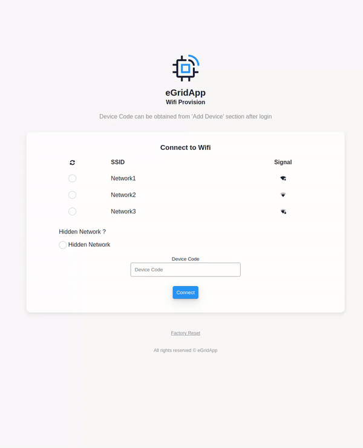
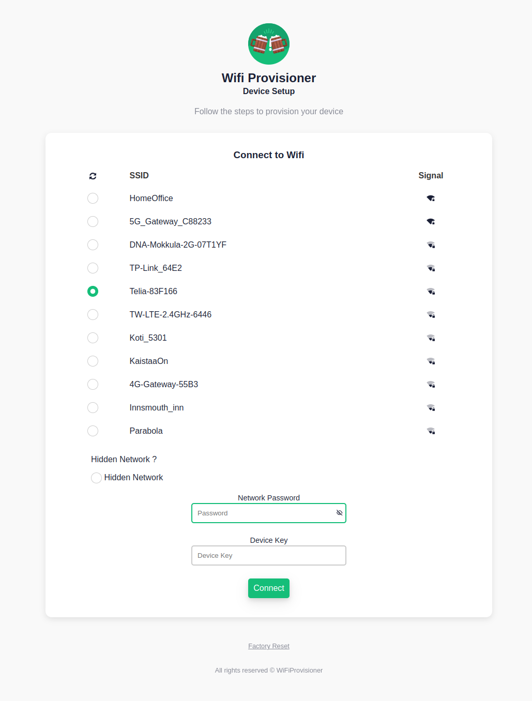
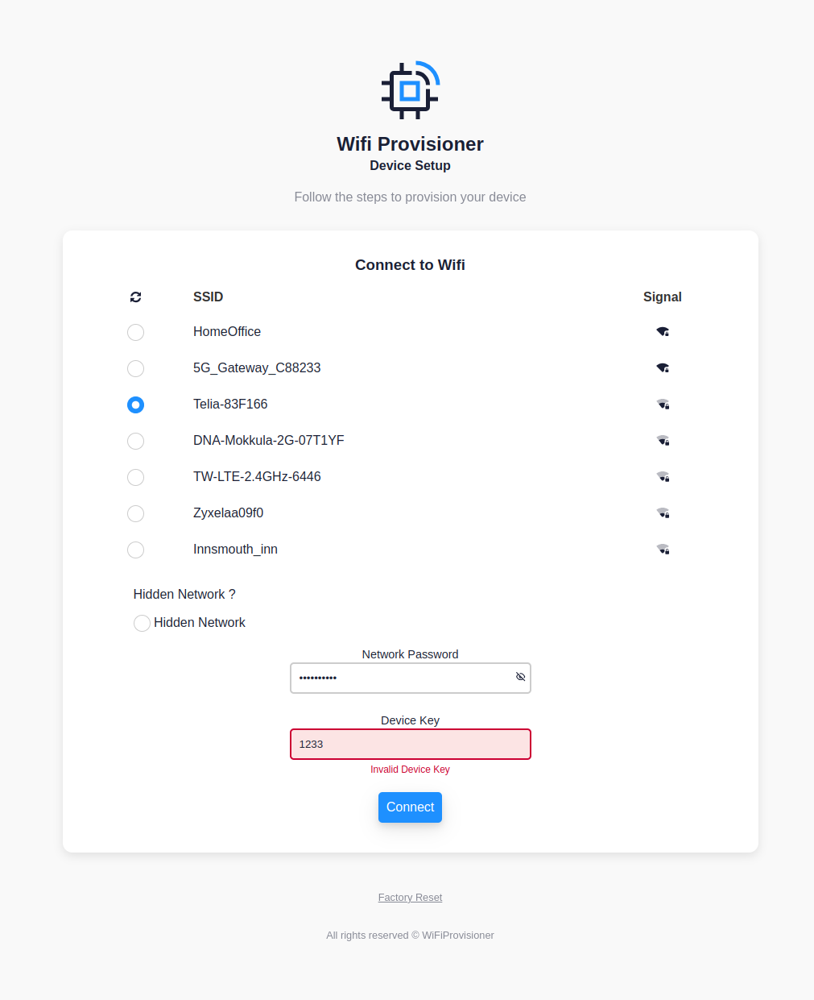

# WiFi Provisioning Library for ESP32

This library provides an easy-to-use, customizable solution for setting up a modern-looking WiFi provisioning captive portal on an ESP32 device. This allows you to effortlessly provision your ESP32 with WiFi credentials and get custom input via an intuitive user interface.

> _**Note:** This library is designed for ESP32 devices and depends on the ESP32 core and its specific libraries (DNSServer, WebServer, and WiFi). Make sure you have the ESP32 core installed in your Arduino IDE before using this library._

##  Features
-   Access Point mode with captive portal for WiFi provisioning
-   Integrated web server featuring a modern and user-friendly interface
-   Easily customizable HTML content, including logo, text, and error messages
-   Callbacks for input validation and factory reset
-   Optional input field for user-specific data
-   Configurable connection timeout and behavior



 

## Installation
### Installation from ZIP file
1. Download the library as a ZIP file.
2. Open the Arduino IDE, go to **Sketch** > **Include Library** > **Add .ZIP Library**, and select the downloaded ZIP file.
3. The library will be installed and available in the **Examples** menu.

### Installation using Arduino Library Manager

1. Open the Arduino IDE, go to **Tools** > **Manage Libraries**.
2. In the Library Manager window, type `WiFiProvisioner` into the search bar.
3. Find the library in the search results, select the latest version, and click **Install**.

## Usage

1. Include the library in your Arduino sketch:

```cpp
#include <WiFiProvisioner.h>

WiFiProvisioner::WiFiProvisioner provisioner;

void setup() {
  provisioner.connectToWiFi();
}

void loop() {
  // Your application logic here
}
```
## Functions

#### `connectToWiFi()`
Initiates the connection to the WiFi network. If the device has stored credentials, it will use those. Otherwise, it will set up an access point and start the captive portal. For manual connection ip adress is `http://192.168.4.1/`

#### `setupAccessPointAndServer()`
Sets up the access point and server for the captive portal. This function is called automatically by `connectToWiFi()` if necessary.

#### `resetCredentials()`
Resets the stored WiFi credentials.

#### `setConnectionTimeout(unsigned long timeout)`
Sets the connection timeout for the WiFi connection attempt. Default timeout for existing connection is forever. If you want to try connection for a certain time, you can assign a timeout:
```cpp
provisioner.setConnectionTimeout(10000);
```
This will try to connect for 10 seconds, and if not successful, will start the provisioning.

#### `setShowInputField(bool value)`
Shows or hides the input field in the captive portal.

#### `setRestartOnSuccess(bool value)`
Sets whether the device should restart upon successful connection and input validation.

#### `enableSerialDebug(bool enable)`
Enables or disables serial debug messages.

## Callback Types

#### `InputCheckCallback`
A callback function type for input validation. The callback function should take a single `const String&` parameter and return a `bool` indicating if the input is valid or not.
This callback acts as a gatekeeper to ensure the input is correct before proceeding with the completion of the provisioning process and saving the WiFi credentials. If the input validation callback returns `false`, the error message specified by the `INPUT_NOT_VALID` customization option will be displayed. Note that to reach this callback, the WiFi connection must have been made successfully, allowing you to perform checks such as HTTP requests that require an active connection.
Example:
```cpp
bool myInputCheckCallback(const String& input) {
  // Add your custom validation logic here
  return input == "1234";
}
provisioner.setInputCheckCallback(myInputCheckCallback);
```
#### `FactoryResetCallback`
A callback function for performing a factory reset. The callback function should take no parameters and return no value. Implement this callback to define custom behavior when a factory reset is requested. Note that `resetCredentials` is automatically called during the factory reset process, so you don't need to call it separately in the callback.

Example:
```cpp
void myFactoryResetCallback() {
  // Add your custom factory reset logic here
  // For example, clear saved data or restore default settings
  // resetCredentials is automatically called, no need to call it here
}
provisioner.setFactoryResetCallback(myFactoryResetCallback);
```
#### `OnProvisionCallback`
A callback function type for executing custom code before the provisioning process starts. The callback function should take no parameters and return no value. Implement this callback to perform any necessary setup or initialization tasks before the provisioning process begins.

Example:
```cpp
void myOnProvisionCallback() {
  // Add your custom code to be executed before provisioning starts
  // For example, determine whether to show the input field or not and set text fields depending on that
  
  bool showInputCondition = true; // Replace this with your condition

  if (showInputCondition) {
    provisioner.setShowInputField(true);
    provisioner.PROJECT_INFO = "Please submit the code found on your profile page.";
  } else {
    provisioner.setShowInputField(false);
    provisioner.PROJECT_INFO = "";
  }
}

provisioner.setOnProvisionCallback(myOnProvisionCallback);
```

## Customization

You can customize various aspects of the library, such as the HTML content, input validation, and behavior after a successful connection. The following customization options are available:

- `AP_NAME`: Access Point name
- `HTML_TITLE`: Web page title
- `THEME_COLOR`: Theme color
- `SVG_LOGO`: Custom logo in SVG format
- `PROJECT_TITLE`: Title displayed on the provisioning page
- `PROJECT_INFO`: Description or instructions for the user
- `INPUT_TEXT`: Label for the input field
- `INPUT_PLACEHOLDER`: Placeholder text for the input field
- `INPUT_LENGTH`: Maximum input length
- `FOOTER_INFO`: Footer text
- `INPUT_INVALID_LENGTH`: Error message for invalid input length
- `INPUT_NOT_VALID`: Error message for invalid input
- `CONNECTION_SUCCESSFUL`: Success message displayed after a successful connection
- `RESET_CONFIRMATION_TEXT`: Confirmation text for resetting the device

For example, to change the `PROJECT_TITLE`:

```cpp
provisioner.PROJECT_TITLE = "Custom Project Title";
```
To set a custom INPUT_LENGTH:
```cpp
provisioner.INPUT_LENGTH = "5";
```
To set a custom SVG logo:
```cpp
provisioner.SVG_LOGO = R"rawliteral(<svg xmlns="http://www.w3.org/2000/svg" width="50" height="50" viewBox="0 0 50 50"><rect width="50" height="50" rx="10" ry="10" fill="#f00"/></svg>)rawliteral";
```
All of these customization options are set as strings

##  Examples
The library includes examples that demonstrate different customization options. To access the examples, go to File > Examples > WiFiProvisioner in the Arduino IDE.

### Example: Customizing Access Point Name and Theme Color

```cpp
#include <WiFiProvisioner.h>

WiFiProvisioner::WiFiProvisioner provisioner;

void setup() {  
  // Customize the Access Point name and theme color
  provisioner.AP_NAME = "CustomAPName";
  provisioner.THEME_COLOR = "#FFA500";
  
  provisioner.connectToWiFi();
}

void loop() {
  // Your application logic here
}
```
### Example: Using Input Validation Callback

```cpp
#include <WiFiProvisioner.h>

WiFiProvisioner::WiFiProvisioner provisioner;

bool inputValidationCallback(const String& input) {
  // Check if the input is valid, e.g., checking if it's the string "1234"
  return input == "1234";
}

void setup() {
  Serial.begin(115200);
  
  // Set the input validation callback
  provisioner.setInputCheckCallback(inputValidationCallback);

  // Enable the input field
  provisioner.setShowInputField(true);

  // Customize the error message for invalid input
  provisioner.INPUT_NOT_VALID = "Please enter the correct code.";

  // Change the input text and placeholder text
  provisioner.INPUT_TEXT = "Enter access code:";
  provisioner.INPUT_PLACEHOLDER = "Access code";

  // Connect to WiFi or start the provisioning process
  provisioner.connectToWiFi();
}

void loop() {
  // Your application logic here
}

```
### Example: Advanced Factory Reset with Conditional Input Field and Single Button Press Trigger
```cpp
#include <WiFiProvisioner.h>

WiFiProvisioner::WiFiProvisioner provisioner;

const int buttonPin = 2; // GPIO pin number for the button

bool inputValidationCallback(const String& input) {
  // Check if the input is valid, e.g., checking if it's "1234"
  return input == "1234";
}

void factoryReset() {
  // Perform your factory reset logic here
  Serial.println("Factory reset triggered.");

  // Disable the input field after factory reset
  provisioner.setShowInputField(true);
}

void onProvision() {
  // Use a simple if statement to conditionally show the input field
  // For example, if a certain condition is met, show the input field
  if (/* your condition */) {
    provisioner.setShowInputField(true);
  } else {
    provisioner.setShowInputField(false);
  }
}

void setup() {
  Serial.begin(115200);

  // Set the input validation callback
  provisioner.setInputCheckCallback(inputValidationCallback);

  // Set the factory reset callback
  provisioner.setFactoryResetCallback(factoryReset);

  // Set the onProvision callback
  provisioner.setOnProvisionCallback(onProvision);

  // Set the initial input text and placeholder text
  provisioner.INPUT_TEXT = "Enter custom value:";
  provisioner.INPUT_PLACEHOLDER = "Custom value";

  // Set the input length to 4
  provisioner.INPUT_LENGTH = "4"; // Limit the input length to 4 characters

  provisioner.connectToWiFi();

  // Set up the button pin as input
  pinMode(buttonPin, INPUT);
}

void loop() {
  // Read the state of the button
  int buttonState = digitalRead(buttonPin);

  // If the button is pressed, manually start the provisioning by calling the setupAccessPointAndServer() function
  if (buttonState == HIGH) {
    provisioner.setupAccessPointAndServer();
  }
}

```
### License

This library is licensed under the [MIT License](https://opensource.org/licenses/MIT). For more details, please see the `LICENSE` file in the repository.
### Contributing

We welcome contributions to this library! If you have found a bug, have a feature request, or want to contribute code, please open an issue or submit a pull request on the [GitHub repository](https://github.com/SanteriLindfors/WiFiProvisioner).
